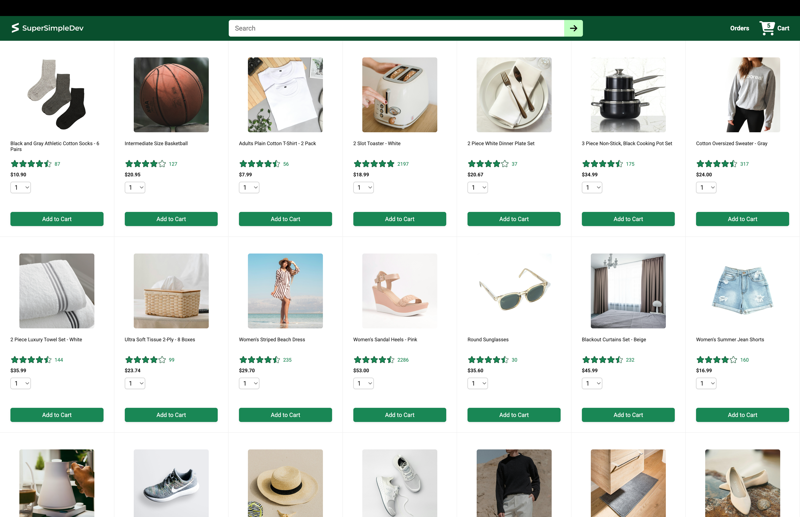
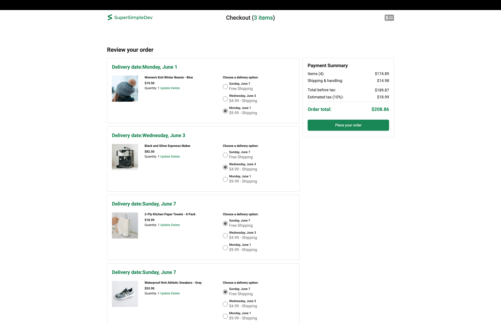
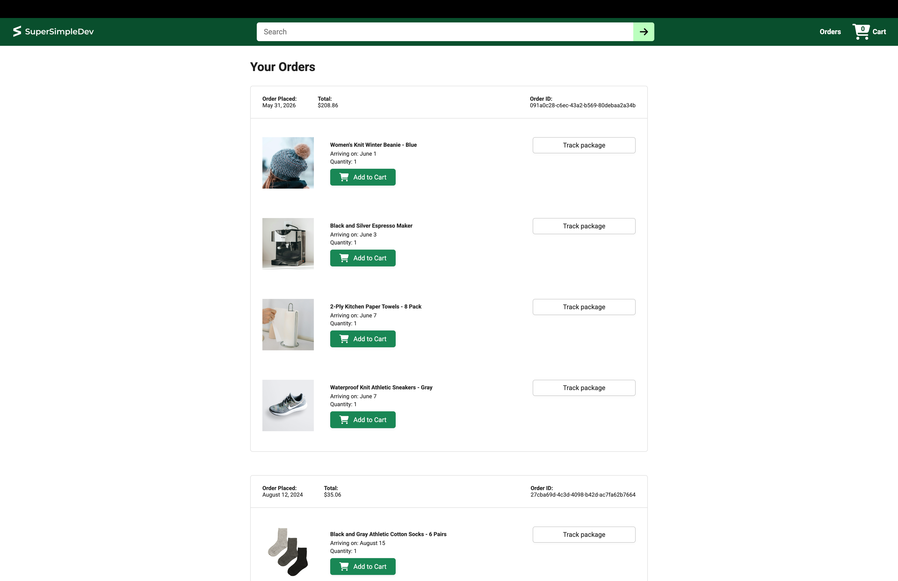

# 🛍️ E-Commerce Project

一个功能完整的React电商网站，包含产品展示、搜索、购物车、订单管理和实时配送跟踪功能。

## ✨ 主要功能

### 核心功能
- 📱 **产品展示** - 响应式网格布局，支持8列到流动显示
- 🔍 **搜索功能** - 实时搜索产品，URL参数持久化
- 🛒 **购物车管理**
  - 添加/删除商品
  - 修改数量
  - 自动更新配送选项
  - 支付总结实时更新

### 高级功能
- 📦 **配送选项** - 多种配送方式选择
- 💳 **结账流程** - 二栏布局（订单总结 + 支付总结）
- 📋 **订单管理** - 查看订单历史，按日期排序
- 📍 **配送跟踪** - 动态进度条，实时状态显示（准备中、已发货、已送达）
- ✅ **自动化测试** - 13+个单元和集成测试

## 🛠 技术栈

| 技术 | 说明 |
|------|------|
| **React 19** | 前端框架 |
| **Vite 6** | 构建工具 |
| **React Router 7** | 路由管理 |
| **Axios** | HTTP客户端 |
| **Vitest** | 单元测试框架 |
| **React Testing Library** | 组件测试库 |
| **CSS3** | 样式（Grid、Flexbox） |

## 📦 项目结构

```
src/
├── components/          # 共享组件
│   └── Header.jsx       # 顶部导航（搜索+购物车+订单）
├── pages/
│   ├── home/           # 首页
│   │   ├── HomePage.jsx
│   │   ├── product.jsx
│   │   ├── productsGrid.jsx
│   │   └── *.test.jsx
│   ├── checkout/       # 结账页
│   │   ├── CheckoutPage.jsx
│   │   ├── OrderSummary.jsx
│   │   ├── CartItemDetails.jsx
│   │   ├── DeliveryOptions.jsx
│   │   ├── paymentSummary.jsx
│   │   └── PaymentSummary.test.jsx
│   ├── orders/         # 订单页
│   │   ├── OrdersPage.jsx
│   │   ├── OrdersGrid.jsx
│   │   ├── OrderHeader.jsx
│   │   └── OrderDetailsGrid.jsx
│   └── Trackingpage.jsx # 配送跟踪页
├── utils/
│   └── money.js        # 货币格式化工具
├── App.jsx             # 路由配置
└── main.jsx            # 应用入口
```

## 🚀 快速开始

### 前置要求
- Node.js 18+
- npm 9+

### 安装依赖
```bash
npm install
```

### 开发模式运行
```bash
npm run dev
```
访问 `http://localhost:5173`

### 生产构建
```bash
npm run build
npm run preview
```

### 运行测试
```bash
npm test              # 运行测试（观察模式）
npm test -- --run     # 运行测试一次
```

## 📸 界面展示

### 首页 - 产品展示与搜索


### 购物车 - 结账页面


### 订单 - 历史订单


### 配送追踪 - 实时进度


## 📋 课程练习完成情况

### Lesson 8 - 核心功能
- ✅ 8a-8d: 添加购物车、Added消息
- ✅ 8e-8i: 数量编辑功能
- ✅ 8j-8l: 搜索功能实现

### Lesson 9 - 自动化测试
- ✅ 9a: formatMoney(0) → '$0.00'
- ✅ 9b: 负数格式 → '-$9.99'
- ✅ 9c-9e: Product组件测试
- ✅ 9f: userEvent复用
- ✅ 9g-9h: HomePage Add to Cart测试
- ✅ 9i-9j: PaymentSummary集成测试

**测试覆盖**: 13/13 tests ✓

## 📝 笔记

### 关键实现
- 搜索使用URL参数 `?search=query` 持久化
- 配送跟踪通过 `useParams()` 获取 `:orderId/:productId`
- 进度计算: `(timePassedMs / totalTimeMs) * 100`
- 支付总结依赖购物车更新自动刷新

### 文件说明
- `money.js` - 处理正负数的货币格式化
- `CartItemDetails.jsx` - 提取的可复用组件（数量编辑）
- `PaymentSummary.jsx` - 支付总结（使用useNavigate）

## 🤝 后端API

与 `ecommerce-backend` 项目配合使用：
- `GET /api/products` - 获取产品列表
- `GET /api/products?search=` - 搜索产品
- `POST /api/cart-items` - 添加到购物车
- `PUT /api/cart-items/:productId` - 更新数量
- `DELETE /api/cart-items/:productId` - 删除项
- `GET /api/orders` - 获取订单列表
- `GET /api/orders/:orderId` - 获取单个订单
- `POST /api/orders` - 创建订单
- `GET /api/delivery-options` - 获取配送选项
- `GET /api/payment-summary` - 获取支付总结

## 📖 相关资源

- [React官方文档](https://react.dev)
- [Vite官方文档](https://vitejs.dev)
- [React Router文档](https://reactrouter.com)
- [Vitest文档](https://vitest.dev)

## 📄 许可证

MIT License

---

**作者**: yoyo | **最后更新**: 2026年5月
